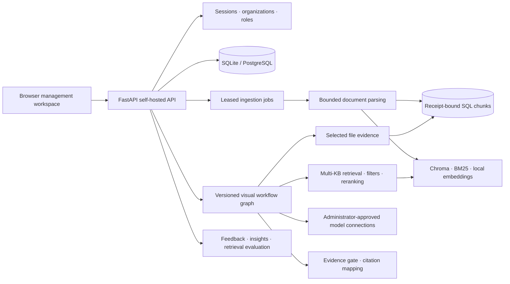

# Zhixu · Enterprise Knowledge

[简体中文](README_zh.md)

Zhixu is a free, open-source, self-hosted knowledge workspace for internal teams and customer-support operations. It keeps documents, retrieval, model connections, visual workflows, evidence citations, feedback and evaluation inside the deployment you control.

The product brand is **Zhixu · Enterprise Knowledge**. The canonical repository is [KaiserIIII/zhixu](https://github.com/KaiserIIII/zhixu). Links to the former `universal-knowledge-base` repository redirect here; the branch with that name preserves the original release.

## Capabilities

- Multi-tenant organizations with owner, admin, editor and viewer roles.
- Multiple knowledge bases with bounded document parsing and durable import jobs.
- Selectable file parser modules, Chinese encoding support, structured tables and SHA-256 receipts; a file-evidence workflow node reads selected parsed documents.
- Hybrid retrieval, optional reranking, evidence gates and source-bound citations.
- Multiple OpenAI-compatible model connections and parallel or synthesis workflows.
- A drag-and-drop workflow editor with drafts, immutable versions, rollback and run traces.
- Conversation feedback, knowledge-gap insights, retrieval evaluation and export.
- Chinese and English management interfaces with persisted language selection.

The default runtime has no member, knowledge-base, document or answer-count limits. It does not call payment services and does not collect telemetry by default. Operators can apply local infrastructure controls such as reverse-proxy limits, storage policies or process-level budgets without adding product dependencies.


The screenshot uses synthetic documents and local adapters. See [verification evidence](docs/verification.md).

## Architecture

The architecture diagram is available below and in the standalone [architecture reference](docs/architecture.md), which also includes a plain-text fallback for GitHub views that do not render Mermaid.



Every organization-scoped query is checked through SQL membership. Retrieval results are rehydrated and checked before they become model context. Core startup does not load heavyweight models, and no external service is required for the management API.

## Run locally

Use Python 3.13, verified locally on Windows:

```powershell
git clone https://github.com/KaiserIIII/zhixu.git
cd zhixu
python -m venv .venv
.venv/Scripts/python.exe -m pip install -r backend/requirements-rag.lock
Copy-Item backend/.env.template backend/.env
python start.py
```

On Linux use `.venv/bin/python`. Open <http://localhost:8000>, create the first organization, and configure model connections from the management UI. API documentation is available at `/docs`.

For an API-only deployment, install `backend/requirements-core.lock`. Local parsing, embeddings and indexes use the optional RAG lock file. Credentials stay in the deployment environment and are referenced by administrator-approved model profiles.

See [deployment and migration](docs/deployment.md), [parser modules](docs/parsing.md) and [workflow guide](docs/workflows.md). The RAG lock pins direct dependencies; freeze its platform-specific transitive dependencies before building a deployment image. Offline installations should pre-cache embedding weights and use a local model endpoint.

## Data and compatibility

SQLite is suitable for a single instance; PostgreSQL is available for shared deployments. Startup preserves existing records and adds parser settings. Historical accounting tables and columns remain, while the workflow reference's obsolete required constraint is removed transactionally. Existing workspaces and knowledge bases retain their IDs. Back up SQL, source files and indexes together before upgrading; see the deployment guide for explicit ownership migration from the original release.

## Verification

```bash
python -m unittest discover -s tests -v
python -m compileall -q backend/app tests start.py
python -m pip check
node --test tests/web/*.test.mjs
```

The tests use temporary SQLite databases and synthetic retriever/model adapters. They cover tenant isolation, roles, imports, conversations, citations, feedback, evaluation, workflow execution, cancellation, recovery and public file boundaries.

## Contributing and license

Contributions are welcome through issues and focused pull requests. See [contribution guidance](CONTRIBUTING.md). The project is licensed under [Apache-2.0](LICENSE).
