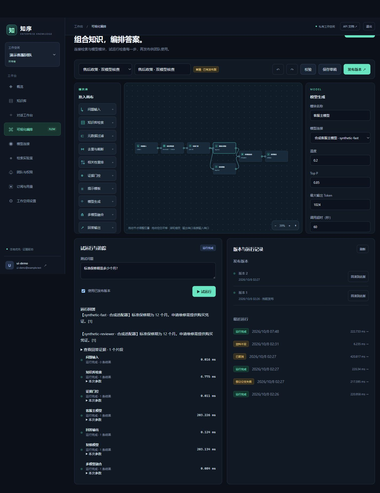
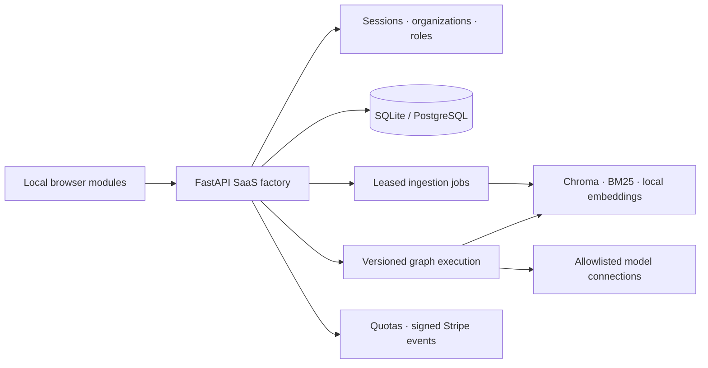

# Zhixu · Enterprise Knowledge

[简体中文](README_zh.md)

A self-hosted knowledge workspace for internal teams and customer support. Connect documents, retrieval strategies and OpenAI-compatible models, then inspect the evidence behind each answer and use team feedback to find missing knowledge.

## What you can build

- **A knowledge service for multiple organizations.** Separate organization data, manage owner/admin/editor/viewer roles, issue revocable API keys and track plan usage.
- **A configurable answer pipeline.** Compose input, multi-KB retrieval, filtering, deduplication, reranking, evidence checks, prompts, model branches, merging and output on a drag-and-drop canvas. Save drafts, publish immutable versions, roll back and inspect node traces.
- **A support operations loop.** Import documents with durable retryable jobs, review grounded conversations and sources, record feedback, export conversations and investigate insufficient-evidence queries.
- **A retrieval comparison workspace.** Compare up to three configurations on labeled questions, with document-level precision, recall, MRR, Hit Rate and nDCG. Unlabeled questions show no invented quality score; answer faithfulness requires review.

Model profiles expose connection settings, prompts and generation parameters through administrator-controlled environment references. Embedding identity remains a deployment setting so that an organization cannot silently change the dimensions of the shared index.



The screenshot uses synthetic documents and model adapters. See [verification evidence and limits](docs/verification.md).

## Architecture



SQL membership and document records determine visible resources. Retrieval results are checked and reconstructed against SQL before use. Core API startup does not load heavyweight models. The browser uses local JavaScript modules and CSS, with no build step or script CDN.

## Run locally

Python 3.13 is the verified core API environment. On Windows:

```powershell
python -m venv .venv
.venv/Scripts/python.exe -m pip install -r backend/requirements-rag.lock
Copy-Item backend/.env.template backend/.env
python start.py
```

On Linux, use `.venv/bin/python` for environment commands. Open [localhost:8000](http://localhost:8000) and create the first organization. The self-hosted API reference is at `/docs`. `start.bat` runs the same foreground launcher; Ctrl+C stops the server.

For a lightweight API-only environment, install `backend/requirements-core.lock`. Local embedding/index/parser capabilities require the optional RAG stack and model cache; model weights may download on first use. The RAG file pins direct releases, while its ML transitive dependencies still require a platform-specific freeze before production delivery. Source/license/commit records are in [docs/dependencies](docs/dependencies).

Configure the default model in `backend/.env`, or add a model profile in the management UI after allowing its host and environment reference:

```dotenv
LLM_API_URL=https://api.deepseek.com/v1/chat/completions
LLM_API_KEY=
LLM_MODEL=deepseek-chat
MODEL_ALLOWED_HOSTS=["api.openai.com","api.deepseek.com"]
MODEL_ALLOWED_SECRET_REFS=["SUPPORT_MODEL_API_KEY"]
```

The default model reads `LLM_API_KEY` from `backend/.env`. Profile references such as `SUPPORT_MODEL_API_KEY` must be injected into the service process environment; writing them only in that file does not export them. Compose explicitly passes the value from its root `.env`. See [deployment](docs/deployment.md) for independent credentials. Strict evidence mode skips the model when no evidence is retrieved. Retrieved context is sent to the configured provider when a model runs; choose the provider and network policy to match your data requirements.

See the [visual workflow guide](docs/workflows.md) for multiple knowledge bases, model branches and published versions.

## Knowledge and plans

Text, Markdown, CSV, JSON, HTML, DOCX, XLSX and PPTX have local text extraction paths. PDFs require the optional text parser; image-only PDF OCR is not included. Office parsing is bounded and text-only, and spreadsheet formulas use cached values. Failed imports retain sources for retry or deletion.

| Plan | Members | Knowledge bases | Documents | Completed answers / UTC month |
| --- | ---: | ---: | ---: | ---: |
| Free | 1 | 3 | 50 | 100 |
| Team | 10 | 20 | 1,000 | 5,000 |
| Business | 50 | 100 | 10,000 | 50,000 |

Answers reserve quota before upstream work. Known failed/canceled operations release it; successful answers finalize it. A process crash can leave a running answer's reservation held for operator reconciliation. Stripe checkout and portal require deployment credentials and price IDs. Browser redirects do not grant a plan: signed events and authoritative subscription state govern entitlements. Prices are configured by the deployer.

## Deployment and upgrades

See [deployment and migration](docs/deployment.md) for Docker Compose, PostgreSQL, HTTPS cookies, backup and explicit legacy workspace claims. New registrations never automatically obtain old workspaces. SQLite is suitable for a single instance; PostgreSQL and shared-index concurrency require deployment validation. Clustered exactly-once index writes are not promised.

The scope does not include SSO/SCIM, a tenant-managed secret vault, arbitrary code execution nodes, OCR or automatic payment reconciliation between multiple completed subscriptions. These require additional integration work before they can be offered as product capabilities.

## Verification

```bash
python -m unittest discover -s tests -v
python -m compileall -q backend/app tests start.py
python -m pip check
node --test tests/web/*.test.mjs
```

The API suite uses temporary SQLite and synthetic retriever, model and payment adapters. It checks authentication, tenant boundaries, quotas, import recovery and failure paths. Real PostgreSQL, Chroma/model execution, Docker runtime and Stripe integration need deployment smoke tests. Interface correctness does not establish retrieval quality or answer faithfulness on your documents.

## Code map

| Path | Responsibility |
| --- | --- |
| `backend/app/saas/` | Scoped identity, billing, knowledge, conversations, evaluation and workflow services |
| `backend/app/rag_engine.py` | Existing local parsing, embedding, index and hybrid retrieval |
| `backend/app/main.py` | Deployable app entrypoint and local UI assets |
| `web/` | Management workspace and visual graph editor |
| `tests/` | Offline API and browser-module behavior tests |
| `backend/.env.template` | Deployment configuration reference |

No project-wide license is currently specified.
