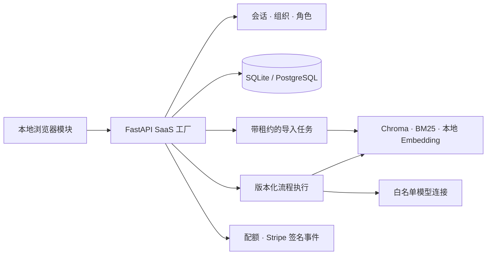

# 知序 · Enterprise Knowledge

[English](README.md)

面向企业内部团队与客服团队的自托管知识工作空间。连接资料、检索策略和 OpenAI 兼容模型，核查每个回答的依据，再通过团队反馈发现缺失的知识。

**产品名称：** **知序 · Enterprise Knowledge**。GitHub 仓库 slug 暂时保留为 `universal-knowledge-base` 以保持链接连续，面向客户展示的产品品牌是“知序”。

## 可以构建什么

- **多组织知识服务。** 隔离组织数据，管理 owner/admin/editor/viewer 角色，签发可撤销 API Key，查看套餐与用量。
- **可配置的问答流程。** 在拖拽画布组合输入、多库检索、过滤、去重、重排、证据门控、提示、模型分支、合并和输出。保存草稿、发布不可变版本、回滚并检查节点运行轨迹。
- **客服知识运营闭环。** 通过持久任务导入资料与重试，查看会话和回答来源、收集反馈、导出对话，定位证据不足的问题。
- **检索比较工作台。** 针对带标签的问题比较最多三套参数，计算文档级 Precision、Recall、MRR、Hit Rate 和 nDCG。未标注问题不显示虚构质量分；回答忠实度需要人工核查。

模型连接支持地址、模型、提示和生成参数配置，凭据使用部署管理员允许的环境变量引用。Embedding 身份保留为部署级设置，防止单个组织直接改变共享索引维度。


截图使用合成资料与模型适配器，详见[验证结果与适用边界](docs/verification.md)。

## 架构

结构图同时提供[独立架构说明](docs/architecture.md)，并附带纯文本回退，确保 GitHub 不渲染 Mermaid 时仍能看到完整结构。



SQL 中的成员关系和文档记录决定可见资源；检索结果在使用前通过 SQL 校验并重建。轻量 API 启动不加载大型模型。浏览器使用本地 JavaScript 模块与 CSS，无需前端构建或脚本 CDN。

## 本地启动

已验证的轻量 API 环境为 Python 3.13。在 Windows 执行：

```powershell
python -m venv .venv
.venv/Scripts/python.exe -m pip install -r backend/requirements-rag.lock
Copy-Item backend/.env.template backend/.env
python start.py
```

Linux 环境命令使用 `.venv/bin/python`。打开 [localhost:8000](http://localhost:8000)，创建第一个组织；自托管 API 文档位于 `/docs`。`start.bat` 使用同一前台启动器，Ctrl+C 停止服务。

轻量 API 环境可仅安装 `backend/requirements-core.lock`。实际本地索引、Embedding 和文档解析需要可选 RAG 依赖与模型缓存，首次使用可能下载模型权重。RAG 文件固定直接依赖版本，其机器学习传递依赖在生产发布前仍需按目标平台完整冻结。来源、许可证与 commit 记录见 [docs/dependencies](docs/dependencies)。

在 `backend/.env` 配置默认模型，或先允许提供者主机和凭据环境变量，再通过管理端添加模型连接：

```dotenv
LLM_API_URL=https://api.deepseek.com/v1/chat/completions
LLM_API_KEY=
LLM_MODEL=deepseek-chat
MODEL_ALLOWED_HOSTS=["api.openai.com","api.deepseek.com"]
MODEL_ALLOWED_SECRET_REFS=["SUPPORT_MODEL_API_KEY"]
```

默认模型的 `LLM_API_KEY` 可从 `backend/.env` 读取。模型连接引用的 `SUPPORT_MODEL_API_KEY` 则需要注入服务进程环境，仅写在该文件不会导出；Compose 在根目录 `.env` 配置后显式传入容器。多套独立凭据的配置见[部署说明](docs/deployment.md)。严格证据模式在没有检索依据时跳过模型调用；运行模型时会把选定上下文发送给配置的提供者，应根据数据要求选择服务和网络策略。

通过[可视化编排指南](docs/workflows.md)配置多知识库、多模型与发布版本。

## 资料与套餐

文本、Markdown、CSV、JSON、HTML、DOCX、XLSX、PPTX 提供本地文本解析路径。PDF 依赖可选文本解析器，不包含扫描 PDF 的 OCR。Office 解析限制资源占用，仅提取文本；表格公式使用缓存值。失败导入保留源文件，供重试或删除。

| 套餐 | 成员 | 知识库 | 文档 | 每 UTC 月成功回答 |
| --- | ---: | ---: | ---: | ---: |
| Free | 1 | 3 | 50 | 100 |
| Team | 10 | 20 | 1,000 | 5,000 |
| Business | 50 | 100 | 10,000 | 50,000 |

回答在上游调用前预留配额，已知失败或取消会释放，成功后确认用量。进程直接崩溃可能留下运行中回答的预留额度，需要运维核对处理。Stripe 结账与客户门户需要部署凭据和价格 ID；浏览器跳转不会授予套餐，签名事件及权威订阅状态决定权限。价格由部署者配置。

## 部署与升级

[部署与迁移说明](docs/deployment.md) 包含 Docker Compose、PostgreSQL、HTTPS Cookie、备份和旧工作区显式认领。新注册账号不会自动获得旧工作区。SQLite 适合单实例；PostgreSQL 与共享索引并发需要部署验收，当前不承诺集群恰好一次索引写入。

当前范围不包含 SSO/SCIM、租户自管密钥保险库、任意代码执行节点、OCR 或多份已付款订阅的自动对账。这些能力需要额外集成后才能作为产品功能提供。

## 验证

```bash
python -m unittest discover -s tests -v
python -m compileall -q backend/app tests start.py
python -m pip check
node --test tests/web/*.test.mjs
```

API 测试使用临时 SQLite，以及合成检索、模型与支付适配器，检查认证、租户边界、配额、导入恢复和失败路径。真实 PostgreSQL、Chroma/模型、Docker 运行与 Stripe 集成需要部署冒烟测试。接口正确性不能证明实际资料的检索质量或回答忠实度。

## 代码导航

| 路径 | 职责 |
| --- | --- |
| `backend/app/saas/` | 带组织范围的身份、计费、知识、会话、评测与编排服务 |
| `backend/app/rag_engine.py` | 现有本地解析、Embedding、索引和混合检索 |
| `backend/app/main.py` | 部署入口和本地页面资源 |
| `web/` | 管理工作空间与可视化编排器 |
| `tests/` | 离线 API 与浏览器模块行为测试 |
| `backend/.env.template` | 部署配置参考 |

项目目前没有声明统一许可证。
