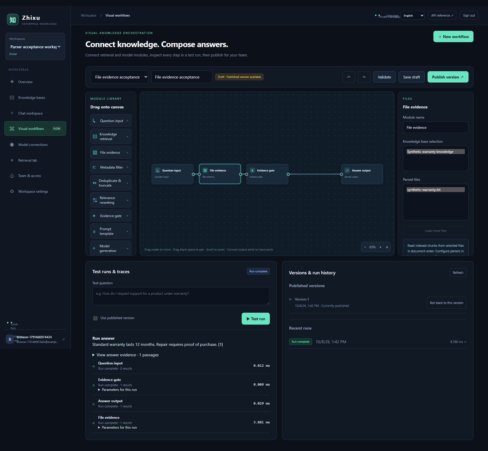
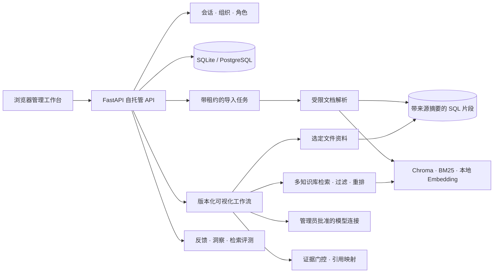

# 知序

[English](README.md)

知序是免费、开源、自托管的企业知识工作空间，面向内部团队与客服团队。文档、检索、模型连接、可视化工作流、证据引用、会话反馈和评测都运行在部署者控制的环境中。

产品品牌为 **知序**，英文为 **Zhixu · Enterprise Knowledge**，正式仓库为 [KaiserIIII/zhixu](https://github.com/KaiserIIII/zhixu)。旧仓库 `universal-knowledge-base` 的链接会重定向至此；同名分支继续保留最原始版本。

## 功能

- 多租户组织隔离，以及 owner、admin、editor、viewer 权限。
- 多知识库、受限文档解析和可恢复的持久导入任务。
- 可选择的文件解析模块、中文编码识别、结构化表格与 SHA-256 来源校验；画布可直接连接已解析文件。
- 混合检索、可选重排、证据门控和绑定来源的引用。
- 多个 OpenAI 兼容模型连接，以及并行或综合式混合模型工作流。
- 可视化拖拽编排器，支持草稿、不可变版本、回滚和运行追踪。
- 会话反馈、知识缺口洞察、检索评测和导出。
- 中文和英文管理端界面，并持久保存语言选择。

默认运行时不限制成员数、知识库数、文档数或回答次数，不调用支付服务，也默认不收集遥测数据。部署者可以在应用外使用反向代理、存储策略或进程级预算进行本地运行保护，不会引入产品依赖。



截图使用合成资料与本地适配器，详见[验证结果](docs/verification.md)。

## 架构

下面的结构图也提供在[独立架构说明](docs/architecture.md)中，文档同时包含纯文本回退图，确保 GitHub 不渲染 Mermaid 时仍能查看完整结构。



每个组织范围的查询都会通过 SQL 成员关系校验，检索结果在进入模型上下文前重新加载并检查。核心启动不会加载大型模型，管理 API 不依赖外部服务。

## 本地启动

使用 Python 3.13，本地验证环境为 Windows：

```powershell
git clone https://github.com/KaiserIIII/zhixu.git
cd zhixu
python -m venv .venv
.venv/Scripts/python.exe -m pip install -r backend/requirements-rag.lock
Copy-Item backend/.env.template backend/.env
python start.py
```

Linux 使用 `.venv/bin/python`。打开 <http://localhost:8000> 创建第一个组织，再从管理端配置模型连接。API 文档位于 `/docs`。

仅运行 API 时可安装 `backend/requirements-core.lock`；本地解析、Embedding 和索引使用可选的 RAG lock 文件。凭据保存在部署环境，由管理员批准的模型连接引用。

详见[部署与迁移](docs/deployment.md)、[文件解析模块](docs/parsing.md)和[工作流指南](docs/workflows.md)。RAG lock 固定直接依赖；构建部署镜像前还应冻结目标平台的传递依赖。离线部署需预备模型权重并使用本地模型端点。

## 数据兼容

SQLite 适合单实例，PostgreSQL 可用于共享部署。启动过程保留已有记录并增量添加解析配置，旧的历史核算表和字段保留但被忽略。旧工作流关联字段的必填约束在事务中解除，原有数据和 ID 保持不变。升级前需同时备份 SQL、源文件和向量索引；原始版本的工作区认领步骤见部署文档。

## 验证

```bash
python -m unittest discover -s tests -v
python -m compileall -q backend/app tests start.py
python -m pip check
node --test tests/web/*.test.mjs
```

测试使用临时 SQLite 和合成检索、模型适配器，覆盖租户隔离、权限、导入、会话、引用、反馈、评测、工作流、取消、恢复和公开文件边界。

## 贡献与许可证

欢迎通过 issue 和 pull request 贡献，详见[贡献指南](CONTRIBUTING.md)。项目采用 [Apache-2.0](LICENSE) 许可证。
