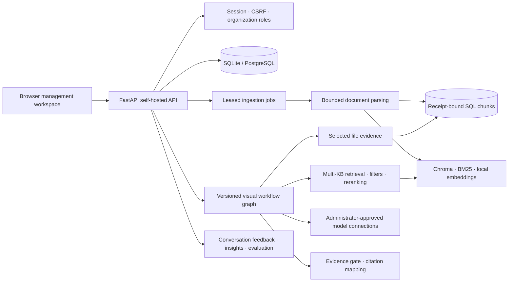

# Zhixu / 知序 architecture

This is the durable architecture reference for **Zhixu · Enterprise Knowledge**, a free, open-source and self-hosted knowledge workspace. The repository slug `universal-knowledge-base` is retained only for URL compatibility. The service does not collect telemetry by default and has no external payment dependency.

## System flow



## Plain-text fallback

```text
Browser management workspace
        |
        v
 FastAPI self-hosted API ---- Session / CSRF / organization roles
        |\
        | +---- SQLite or PostgreSQL (membership, documents, configuration)
        |
        +---- Leased ingestion jobs -> selectable parsers -> SQL chunks + SHA receipts
        |                                 |-> Chroma + BM25 + embeddings
        |
        +---- Versioned visual workflow graph
        |          |-> selected parsed files -> scoped SQL chunks
        |          |-> multi-KB retrieval -> filters -> reranking -> evidence gate
        |          |-> approved model connections -> merge / output / citations
        |
        +---- conversations -> feedback -> insights -> retrieval evaluation
```

## Isolation and runtime boundaries

- Every organization-scoped query is authorized through the SQL membership boundary. Retrieval results are rehydrated and checked against SQL before becoming answer context.
- Model profiles store connection metadata and administrator-approved environment references. Secrets are injected at deployment time; arbitrary URLs and arbitrary code nodes are rejected.
- Workflow drafts are edited on the canvas, validated server-side, published as immutable versions, and executed with node traces, cancellation, evidence limits and local process controls.
- The default service imposes no member, knowledge-base, document or answer-count limit. Operators may apply local infrastructure controls without changing the product or adding external services.
- Legacy accounting fields and tables remain but are ignored. An idempotent startup migration removes the workflow reference's old required constraint transactionally, preserving all rows and columns, indexes and triggers. Parser settings are added with compatible defaults.

See [deployment](deployment.md), [parser modules](parsing.md), [workflow behavior](workflows.md) and [verification evidence](verification.md).
