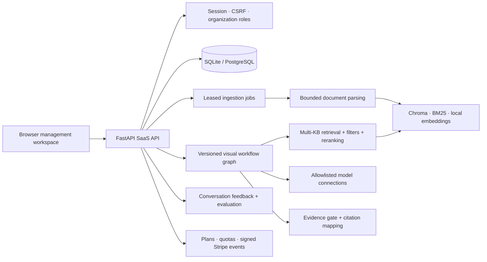

# Zhixu / 知序 architecture

This page is the durable architecture reference for **Zhixu · Enterprise Knowledge**, the multi-tenant knowledge workspace for internal knowledge and customer-support teams. The repository slug `universal-knowledge-base` is retained only for URL continuity.

## System flow



## Plain-text fallback

```text
Browser management workspace
        |
        v
 FastAPI SaaS API ---- Session / CSRF / tenant roles
        |\
        | +---- SQLite or PostgreSQL (membership, documents, plans)
        |
        +---- Leased ingestion jobs -> bounded parsing -> Chroma + BM25 + embeddings
        |
        +---- Versioned visual workflow graph
        |          |-> multi-KB retrieval -> filters -> reranking -> evidence gate
        |          |-> allowlisted model connections -> merge / output / citations
        |
        +---- conversations -> feedback -> retrieval evaluation
        |
        +---- plans -> quotas -> signed Stripe events
```

## Isolation and runtime boundaries

- Every organization-scoped query is authorized through the SQL membership boundary. Retrieval results are rehydrated and checked against SQL before they become answer context.
- Model profiles store connection metadata and administrator-approved environment references. Secrets are injected at deployment time; arbitrary URLs and arbitrary code nodes are not accepted.
- Workflow drafts are edited on the canvas, validated server-side, published as immutable versions, and executed with node traces, cancellation, evidence budgets, and quota accounting.
- The lightweight API startup does not load heavyweight embedding or parser models. Local indexes and model adapters are deployment capabilities, so the same product can run as a single-instance self-hosted service or a PostgreSQL-backed SaaS deployment.

See the [visual workflow guide](workflows.md), [deployment and migration guide](deployment.md), and [verification evidence](verification.md) for operational details and known limits.
